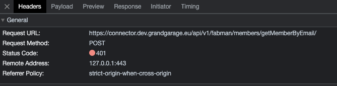

<p align="center">

</p>

# GrandGarage - Website (nuxtJs)

The Web application for [grandgarage.eu](https://grandgarage.eu/). <br>
It includes a memberportal for the services at Grand Garage, a makerspace in Linz, Austria.

## Tech Stack

| Platform     | Description / Link                                                                                                 |
|--------------| ------------------------------------------------------------------------------------------------------------------ |
| NuxtJs v2.16 | a higher-level framework of the JS-framework [vuejs](https://vuejs.org/) / [official website](https://nuxtjs.org/) |
| Storyblok    | a modern headless CMS / [official website](www.storyblok.com)                                                      |
| Netlify      | a build and deployment platform / [official website](https://www.netlify.com/with/vue/)                            |

## Requirements
  | Tool     | Description / Link                                                    |
  |----------|-----------------------------------------------------------------------|
  | Node v18 | [NodeJs](https://nodejs.org/en)                                       |
  | IDE      | [VS Code ](https://code.visualstudio.com/) with the [Volar](https://marketplace.visualstudio.com/items?itemName=Vue.volar) extension or WebStorm/[PHPStorm](https://www.jetbrains.com/phpstorm/)                                                                |
  | Terminal | [VS Code's integrated terminal](https://code.visualstudio.com/docs/terminal/basics) or [PHPStorm terminal](https://www.jetbrains.com/help/phpstorm/terminal-emulator.html) |

(see also [Nuxt - Get started](https://nuxtjs.org/docs/get-started/installation/))

### SSL

To support https on localhost, follow these steps:

1. Install brew ([linux](https://docs.brew.sh/Homebrew-on-Linux), [macOs](https://www.storyblok.com/faq/setup-dev-server-https-proxy))
2. Install SSL certificate:
    ```
    cd ../webapp/
    brew install mkcert
    mkcert -install
    mkcert localhost
    ```
   
#### FAQ
##### Request failed to proxy: ECONNREFUSED
Make sure you use a supported NodeJS Version in all of your Terminal sessions. Node Version can be switches by using [NVM](https://github.com/nvm-sh/nvm).

Another reason for the error message could be that nuxt-production is not loading properly anymore

##### Auth0 Login Error: Unable to configure verification page

It looks like other users have experienced this as a result of 3rd party cookie blocking in Safari, and possibly Firefox.
You can confirm this by setting up a custom domain and seeing if that fixes the issue.
https://community.auth0.com/t/unable-to-configure-verification-page-in-firefox-while-i-am-getting-access-token-in-chrome/103158

## Start

```
# Install Dependencies
cd /webapp/ && yarn

# Start https proxy
yarn proxy
```

Choose your **ENVIRONMENT:** <br>
_local_ | _develop_ | _staging_ | _production_

<br>

### Local

| Local       | https://localhost:3010                                                |
| ----------- | --------------------------------------------------------------------- |
| Audience    | Developers                                                            |
| Environment | Docker                                                                |
| Connector   | [connector.dev.grandgarage.eu](https://connector.dev.grandgarage.eu/) |
| Auth0       | Depends on _package.json_ script                                      |

```
# Tab 2 - Run & Build the app
yarn run nuxt-local

# Tab 3 - Start netlify functions (works only with valid token)
yarn run nuxt-local
```

<br>

### Develop

| Local       | [develop.grandgarage.eu](https://develop.grandgarage.eu/)                    |
| ----------- | ---------------------------------------------------------------------------- |
| Audience    | Developers                                                                   |
| Environment | NodeJs 16 / PHP 8.\*                                                         |
| Connector   | [develop.connector.grandgarage.eu](https://develop.connector.grandgarage.eu) |
| Auth0       | [gg-develop](https://manage.auth0.com/dashboard/eu/gg-develop/users)         |

```
#  Tab 2 - Run & Build the app
yarn run nuxt-develop

#  Tab 3 - Start netlify functions (works only with valid token)
yarn run nuxt-develop
```

<br>

### Staging

| Local       | [staging.grandgarage.eu](https://staging.grandgarage.eu/)                    |
| ----------- | ---------------------------------------------------------------------------- |
| Audience    | QA Testers                                                                   |
| Environment | production mirror                                                            |
| Connector   | [staging.connector.grandgarage.eu](https://develop.connector.grandgarage.eu) |
| Auth0       | [gg-staging](https://manage.auth0.com/dashboard/eu/gg-staging/users)         |

```
# Tab 2 -  Run & Build the app
yarn run nuxt-staging

# Tab 3 -  Start netlify functions (works only with valid token)
yarn run nuxt-staging
```

<br>

### Production

| Local       | [grandgarage.eu](https://grandgarage.eu/)                              |
| ----------- | ---------------------------------------------------------------------- |
| Audience    | Users                                                                  |
| Environment | NodeJs 16 / PHP 8.\*                                                   |
| Connector   | [connector.grandgarage.eu](https://connector.grandgarage.eu)           |
| Auth0       | [grandgarage](https://manage.auth0.com/dashboard/eu/grandgarage/users) |

```
# Tab 2 -  Run & Build the app
yarn run nuxt-production

# Tab 3 -  Start netlify functions (works only with valid token)
yarn run nuxt-production
```

<br>

### Prepare for Deployment

```
# Generate static HTML
yarn run generate
```

## FAQs
### How to connecte a Storyblok Component with the webapp?
Check how to connect Bloks [here](https://grandgarage.atlassian.net/wiki/spaces/ITINT/pages/2369486915/Neuen+Block+anlegen+v1).

### Request failed to proxy: ECONNREFUSED
Make sure you use a supported NodeJS Version in all of your Terminal sessions. Node Version can be switches by using [NVM](https://github.com/nvm-sh/nvm).

### Can't login on localhost


Make sure connector.dev.grandgarage.eu is accessible (run docker or see connector readme) and that you are using the secure localhost:3010 port (proxy).


## Architecture
<br>
<p align="center">

</p>
