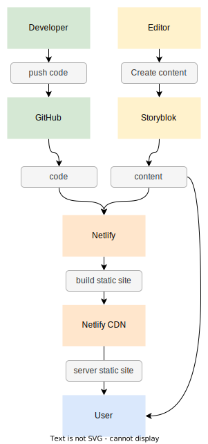

# GrandGarage - Website (vueJs)

This badly named repository contains the source code that powers the web application hosted at [grandgarage.eu](https://grandgarage.eu/).  It's a member portal to interface with services at Grand Garage, a makerspace in Linz, Austria.

 

## Prerequisites
(see also [Nuxt - Get started](https://nuxtjs.org/docs/get-started/installation/))
* [nodeJs](https://nodejs.org/en)
* A text editor, we recommend [VS Code ](https://code.visualstudio.com/) with the [Volar](https://marketplace.visualstudio.com/items?itemName=Vue.volar) extension or WebStorm/[PHPStorm](https://www.jetbrains.com/phpstorm/).
* A terminal, e.g. [VS Code's integrated terminal](https://code.visualstudio.com/docs/terminal/basics) or [PHPStorm terminal](https://www.jetbrains.com/help/phpstorm/terminal-emulator.html) .

## Setup

1. **Install Dependencies**
   `yarn`

2. **Run local webserver** depending on used environment
   1. `yarn run nuxt-develop`
   2. `yarn run nuxt-staging`
   3. `yarn run nuxt-production`

3. **Use netlify functions**  (works only with valid token)  
   1. `yarn lambda-develop`
   2. `yarn lambda-staging`
   3. `yarn lambda-production`
 

### Prepare for Deployment

**Generate static HTML**
`yarn run generate`

  

## Tech Stack

| Platform  | Description / Link                                                                                                 |
|-----------|--------------------------------------------------------------------------------------------------------------------|
| NuxtJs    | a higher-level framework of the JS-framework [vuejs](https://vuejs.org/) / [official website](https://nuxtjs.org/) 
| Storyblok | a modern headless CMS / [official website](www.storyblok.com)                                                      |
| Netlify   | a build and deployment platform / [official website](https://www.netlify.com/with/vue/)                            |

 

